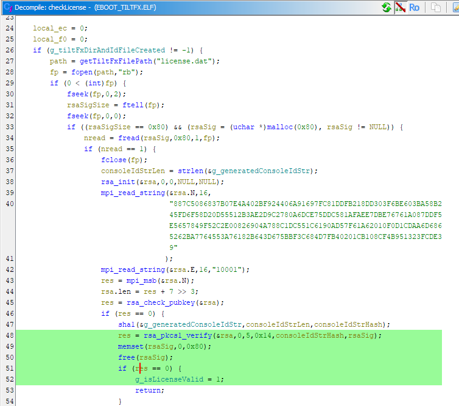

# TiltFX PSP patcher

TiltFX is an application made by Datel that adds tilt-based motion controls to the PSP.  
It takes the form of a signed updater EBOOT (ie. `PSP/GAME/UPDATE/EBOOT.PBP`).  

This simple tool will patch the TiltFX EBOOT executable to make it license-free.  
TiltFX can then be used on any device without a license (nor the license files).  
See below for the original (and deprecated) licensing process.

# Downloads
- [Get the already patched TiltFX PSP app here][2]
- [Get the original TiltFX PSP app here][3] or also [in this repo](data/TiltFX)

# Requirements

You need the following installed to run this tool:
- python 3
- pip and the following packages:
    1. PyCryptodome (`pip install pycryptodome`)
    2. ecdsa (`pip install ecdsa`)

Due to the way it works, TiltFX only works on firmware 6.20 max.  
It was also tested working on 6.20 TN-E Extended, but not 6.20 PRO C2.  

# Usage
## Tool
Clone this repo, then open a shell in this directory.  
On Linux, first do this:
```shell
chmod +x tiltfx.py
```
Then generate the patched `EBOOT.PBP` file from the original application file.
```shell
./tiltfx.py data/TiltFX/EBOOT.PBP.ori EBOOT.PBP
```
## TiltFX
1. Rename the generated file to `EBOOT.PBP` if it's not the case
2. Copy it to your MemoryStick inside the `PSP/GAME/UPDATE/` directory (overwrite any existing file)
3. TiltFX now appears in the games section
<div style="text-align: left;"></div>

## Licensing process
Technical details for the curious folks.

The only way to get a valid license is using Datel's [TiltFX Setup tool][1] on PC.  
It has become useless since their server is offline, however, it worked as follows:
1. Read the `ms0:/TILTFX/id.txt` file from the MemoryStick which contains a per-device ID.  
   This ID string is generated every time the PSP TiltFX app is run.  
   It's basically the PSP FuseID encrypted with AES using Datel's 128-bits static key.
2. Compute the SHA-1 hash of the read ID string.
3. Send the computed SHA-1 hash to Datel's server.
4. Datel signs the received hash with their RSA-1024 private key.  
5. Receive the RSA signature of the hash from the server.
6. Save the RSA signature data to a new `ms0:/TILTFX/license.dat` file.

The PSP TiltFX application then verifies the RSA signature with the public key.  
It sets a global variable to true when it's valid, and false otherwise.   

See the `checkLicense()` function at address `0000d79c` in the executable:  


The patch makes it always set the global variable to true.

See this [gist for the `id.txt` generation algorithm][4].

# Credits
XSpalter for providing the original TiltFX PSP binary  
Davee for his `psptools` taken from [Infinity][5]  
Linblow for this patcher

  [1]: https://archive.org/details/tiltfx-setup-1.00
  [2]: https://static.socom.cc/archive/datel/tiltfx/TiltFX_free.zip
  [3]: https://static.socom.cc/archive/datel/tiltfx/TiltFX_original.zip
  [4]: https://gist.github.com/Linblow/68de00bc117c38c40c7edc25a7b31d95
  [5]: https://github.com/DaveeFTW/Infinity
